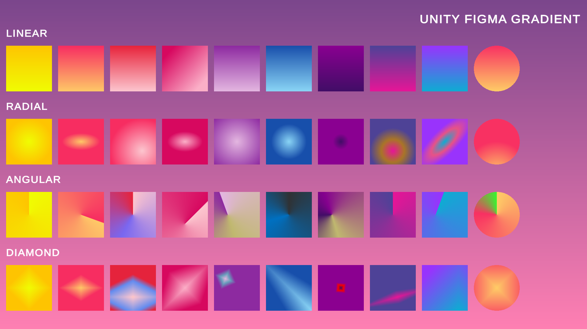

# Unity Figma Gradients

Библиотека реализующая градиенты Figma в UI в Unity с помощью шейдеров для уменьшения веса билда и отсутствия артефактов сжатия на градиентах.

Установка через Unity Package Manager / Add package from git URL:
https://github.com/Nox7atra/Unity-Figma-Gradients.git?path=/Assets/Figma%20Gradients

Для использования необходимо добавить компонент соответствующего типа градиента на RectTransform внутри канваса.

На данный момент есть 4 вида градиентов:

__UIFigmaGradientLinearDrawer__ - линейный градиент

__UIFigmaGradientAngularDrawer__ - конический градиент (не полная поддержка)

__UIFigmaGradientRadialDrawer__ - сферический градиент

__UIFigmaGradinetDiamondDrawer__ - ромбовый градиент 

## Импорт из CSS
Для __UIFigmaGradientLinearDrawer__ есть специальная функция для импорта параметров с помощью CSS из Figma. Для этого необходимо скопировать строку из поля _background:_ 

Пример строки: _linear-gradient(0deg, #FECC66 0%, #F83062 100%);_

Данная функция для остальных типов градиентов в разработке.
## Полезные поля классов:
__Gradient Resolution__ - так как градиенты работают через генерацию текстуры размера _1хGradientResolution_ то данное поле позволяет подобрать минимальное подходящее разрешение для вашего градиента.

Статья с описанием принципов работы: https://habr.com/ru/post/537256/

# Unity Figma Gradients - EN

A library that implements Figma gradients in the UI in Unity using shaders to reduce build weight and avoid compression artifacts on gradients.

To use it, you need to add a component of the appropriate type of gradient to the RectTransform inside the canvas.

There are currently 4 types of gradients:

__UIFigmaGradientLinearDrawer__ - linear gradient

__UIFigmaGradientAngularDrawer__ - conical gradient (not full support)

__UIFigmaGradientRadialDrawer__ - spherical gradient

__UIFigmaGradinetDiamondDrawer__ - diamond gradient

## Import from CSS
There is a dedicated function for __UIFigmaGradientLinearDrawer__ to import parameters using CSS from Figma. To do this, copy the line from the _background field:_

Example line: _linear-gradient (0deg, # FECC66 0%, # F83062 100%);_

This function is for other types of gradients in development.
## Useful class fields:
__Gradient Resolution__ - since gradients work through generating a texture of size _1xGradientResolution_, this field allows you to choose the minimum suitable resolution for your gradient.
